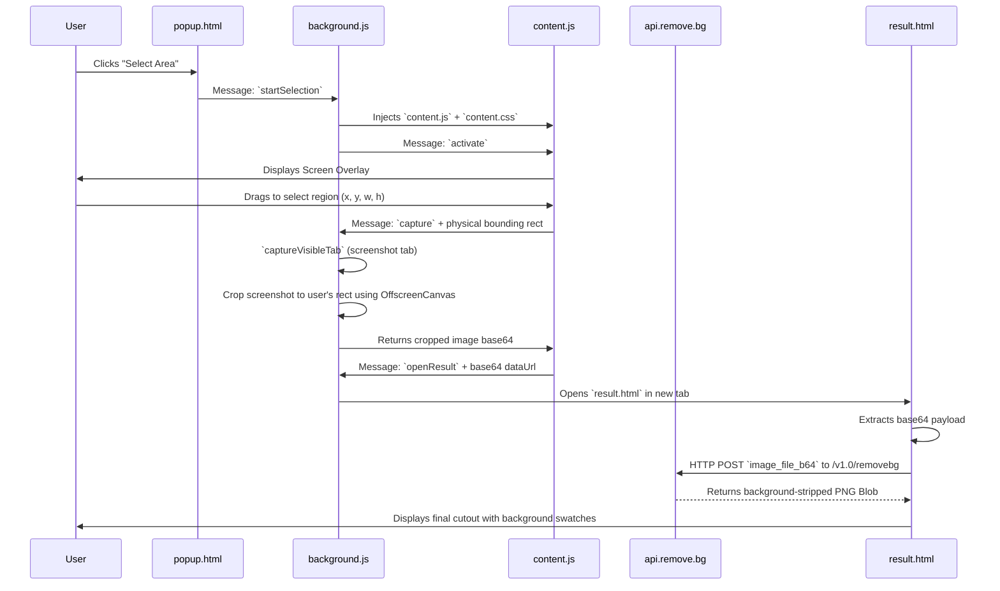

<div align="center">
  <div style="font-size: 80px;">✂️</div>
  <h1>SnapCut</h1>
  <p><strong>A Chrome Extension for Instant On-Screen Background Removal</strong></p>
  
  
  
  
</div>

<br />

## Overview
**SnapCut** is a lightweight, extremely powerful Chrome extension that allows users to seamlessly select any area of their current browser window, instantly capture the pixels, and remove the image background using the industry-leading **remove.bg API**.

It's perfect for quickly extracting product images, avatars, logos or any other graphical elements precisely as they appear on screen—without needing to manually save images or open desktop editors.

---

## ⚡ Tech Stack

| Component | Technology | Description |
|-----------|-----------|-------------|
| **Core Architecture** | Chrome Extension API (MV3) | Service workers, scripting injection, tab capture. |
| **Logic layer** | Vanilla JavaScript | High-performance, zero-dependency ES6 Javascript. |
| **Styling** | Vanilla CSS | Modern CSS, variables, keyframe animations, glassmorphism UI. |
| **Processing** | Remove.bg API | High-fidelity ML-driven background removal over HTTPS. |

---

## 🔄 Information Flow

The following diagram illustrates exactly how data flows from user action to the final cutout image.



---

## 📂 Architecture Breakdown

SnapCut is built with a highly decoupled architecture designed for speed and reliability:

| File | Role | Details |
|------|------|---------|
| `manifest.json` | **Configuration** | Declares MV3 permissions (`activeTab`, `scripting`, `storage`) & resources. |
| `popup.html` | **Entry Point** | The minimal extension popup triggering the workflow. |
| `background.js` | **Service Worker** | Handles messaging, tab screenshotting, precise bounding-box cropping, and spawning the result page. |
| `content.js` | **UI Injector** | Creates the drag-to-select overlay in the DOM. Captures coordinates safely without breaking the host page. |
| `content.css` | **Overlay Styles** | Highly specific (using IDs & classes) CSS to ensure the selection box looks identical on any website. |
| `result.html` | **Result UI** | Beautiful, hardware-accelerated dashboard to view the original and processed image alongside colour swatches. |
| `result.js` | **Processing Engine** | Coordinates the file encoding, makes the secure fetch request to `remove.bg`, and constructs the final canvas for download. |

---

## 🚀 Setup & Integration

Follow these steps to integrate and run SnapCut locally.

### 1. Requirements
- Google Chrome (or any Chromium-based browser)
- A **remove.bg API Key**. Get yours for free at [remove.bg/api](https://www.remove.bg/api).

### 2. Configure API Key
Open `result.js`, locate the `REMOVE_BG_API_KEY` constant, and ensure your key is present:
```javascript
const REMOVE_BG_API_KEY = 'YOUR_API_KEY_HERE';
```
*(Note: A development key is currently configured in the repo).*

### 3. Install in Chrome
1. Open Chrome and navigate to `chrome://extensions/`
2. Enable **Developer mode** (toggle in the top right corner).
3. Click **Load unpacked**.
4. Select the `SnapCut` folder on your local machine.

### 4. Usage
1. Keep the extension pinned to your browser toolbar.
2. Navigate to *any* webpage (Note: Chrome restricts extensions on `chrome://` URLs).
3. Click the **SnapCut** icon.
4. Click **Select Area**.
5. Click and drag your mouse over the element you want to capture.
6. A new tab will immediately open. The image is uploaded to remove.bg, and within seconds, your cutout is ready to composite or download!

---

## 🔒 Permissions Justification

In `manifest.json`, the following permissions are strictly necessary:
- `"activeTab"`: Needed to trigger the selection overlay on the current page.
- `"scripting"`: Needed to dynamically inject `content.js`, keeping the extension lightweight until invoked.
- `"storage"`: Used temporarily (`chrome.storage.local`) to pass the cropped image from `background.js` to `result.html` avoiding URL length limits.
- `"tabs"`: Needed to capture the visible tab screenshot for cropping.

---

<p align="center">
  <i>SnapCut is 100% open-source. For local-only modifications, see previous commits containing the pure-JS Alpha Matting implementation.</i>
</p>
